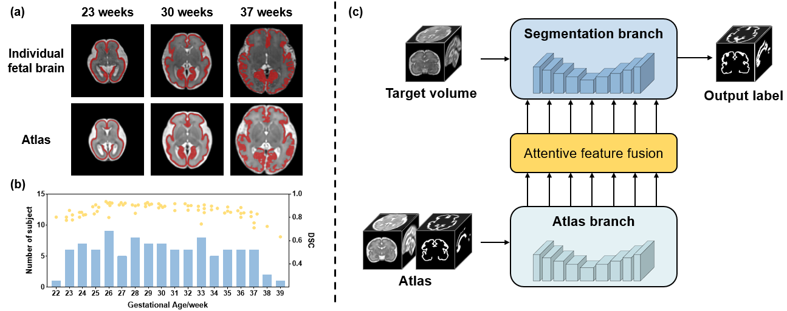
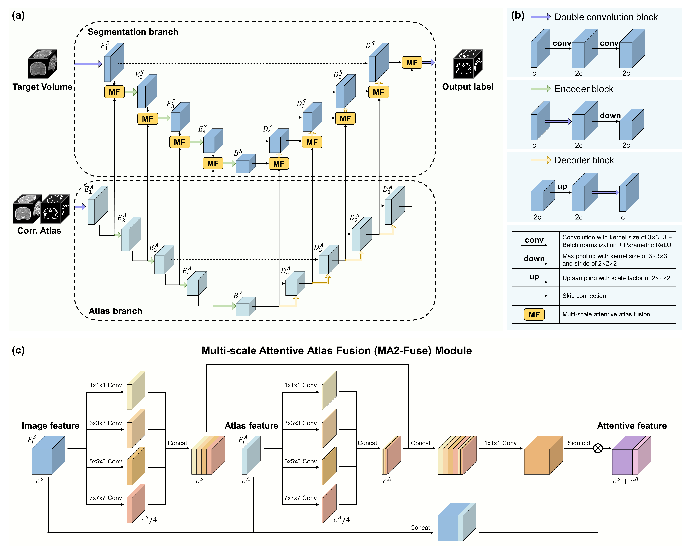

# AtlasSeg: Atlas Prior Guided Dual-U-Net for Fetal Brain MRI Tissue Segmentation
This repository contains relevant code of AtlasSeg: an atlas-guided segmentation network for fetal brain MRI. 

## Introduction
Accurate tissue segmentation in fetal brain MRI remains challenging due to the dynamically changing anatomical anatomy and contrast during fetal development (Fig.1). AtlasSeg is designed to address these difficulties by leveraging a publicly available fetal brain atlas with segmentation labels corresponding to various gestational ages. This allows AtlasSeg to effectively extract contextual features of age-specific patterns and generate accurate tissue segmentation.

<p align="center">
   
</p>
<p align="center">Fig. 1. Examples of difficulties and overview of AtlasSeg <p align="center">

AtlasSeg uses a dual-U-shape convolutional network to facilitate feature flow and information interaction between the atlas branch and the segmentation branch. Multi-scale Attentive Atlas Fusion (MA2-Fuse) constructs dense feature fusions at all stages during encoding and decoding to enhance feature extraction and integration. 

<p align="center">
   
</p>
<p align="center">Fig. 2. Structures of AtlasSeg and MA2-Fuse. <p align="center">

## Requirements
Before using this package for segmentation, you should install the following libraries at least:  
Pytorch  
Some common python packages such as: Nibabel, Numpy, Medpy...

## How to use
1. Compile the requirement library.  
2. Download the 4D spatio-temporal atlas of fetal brain MRI (https://github.com/zjuwulab/Multisite-fetal-brain-atlas).  
3. Match each input volume to the atlas based on gestational age.  
4. Run the following code to train the network  
```
python train.py
```
5. Run the following code to test the network
```
python inference.py
```

## Acknowledge and Statement
Feel free to contact me (haoanxu@zju.edu.cn) or open an issue if you have any question or comment. 
